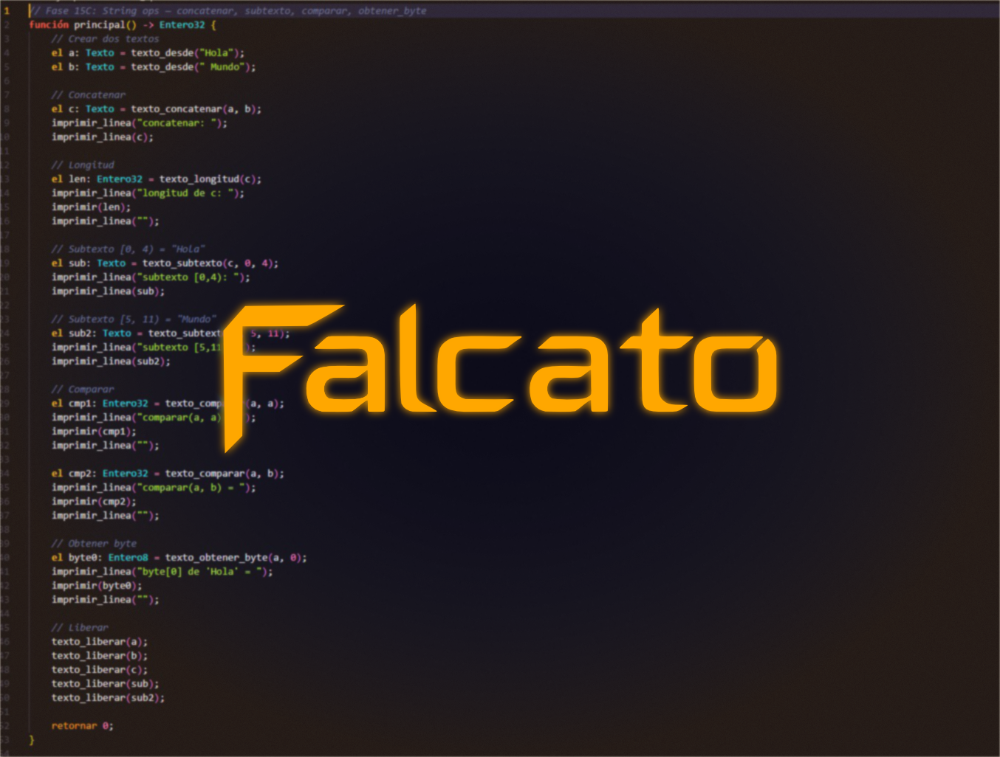

**Lenguaje de sistemas iberohablante.** Forjado sobre Cranelift. Compila a binarios nativos x86_64.

```
.fc → analizador léxico → Parser → Concordancia Lingüística → Codegen (Cranelift) → .o → enlazador → .exe
```

[](https://github.com/CerebroCanibalus/falcato)
[](LICENSE)
[](https://github.com/bytecodealliance/cranelift)
[](https://github.com/CerebroCanibalus/falcato)

---

## 🚀 Inicio rápido (3 pasos)

### 1. Descargar
Ve a [Releases](https://github.com/CerebroCanibalus/falcato/releases) y descarga `falcato-v0.2.0-x86_64-windows.zip` (o la versión más reciente).

### 2. Instalar
Extrae el ZIP y ejecuta `install.ps1` (PowerShell):
```powershell
falcato-v0.2.0-x86_64-windows.zip  →  Extraer aquí
.\install.ps1
```
Menú interactivo: eliges qué instalar (PATH obligatorio, VS Code, OpenCode, Claude Code, Cursor).
Instala `falcato.exe` en `%USERPROFILE%\.falcato\bin` y lo agrega al PATH de usuario.

### 3. Probar
Abre una **terminal nueva** y escribe:
```cmd
falcato version
# → Falcato v0.2.0

falcato run ejemplos\hola_mundo.fc
# → ¡Hola, mundo!
```

> **¿Prefieres compilar desde fuente?** Ver [INSTALL.md](INSTALL.md#opción-2-compilar-desde-código-fuente)

---

## ¿Qué es Falcato?

Falcato es un **lenguaje de programación de sistemas** construido desde cero donde la gramática española no es azúcar sintáctico — **es el sistema de tipos y el modelo de ejecución**.

No traduce keywords de Rust al español. No interpreta pseudocódigo. No es un wrapper sobre otro compilador.

Falcato tiene su propio **analizador léxico** (logos), **parser** (descendente manual con Pratt), **análisis semántico** (Concordancia Lingüística), y **codegen** (Cranelift → .o → .exe). El resultado son binarios nativos x86_64 con ABI de C, sin ejecución oculta, sin recolector de basura.

```falcato
fn principal() -> Entero32 {
    el mensaje: Palabra = "Falcato compila. Punto.";
    imprimir(mensaje);
    retornar 0;
}
```

---

## ¿Por qué Falcato existe?

Hay **~600 millones de hispanohablantes** en el mundo (nativos + L2, Instituto Cervantes 2024). Menos del 5% programa. La barrera no es la lógica — es el lenguaje de la documentación, los errores, y la sintaxis.

Falcato responde a tres preguntas:

| Pregunta | Respuesta |
|----------|-----------|
| **¿Y si el español pudiera expresar garantías de compilación?** | Los artículos (`el`/`la`/`un`) codifican posesión. Los tiempos verbales codifican modos de ejecución. El subjuntivo codifica caminos fríos. |
| **¿Y si un LLM pudiera generar código que compila en Nivel 0?** | Nivel 0 (permisivo) siempre compila. El compilador sugiere, no rechaza. Un LLM genera → compiler sugiere → LLM refina → <3 iteraciones a Nivel 2. |
| **¿Y si la ingeniería de lenguajes pudiera explorar una dimensión lingüística distinta?** | 500+ años de evolución del español ofrecen dimensiones que el inglés no tiene: género, ser/estar, subjuntivo, prefijos productivos, voz activa/pasiva. Falcato las convierte en garantías de compilación. |

---

## Los 5 Pilares

| # | Pilar | Qué significa | Estado |
|---|-------|---------------|--------|
| I | **Género = posesión** | `el` = dueño mutable, `la` = prestado immutable, `un` = opcional | ✅ Implementado |
| II | **Ser/Estar = Const/Mut** | `es` = identidad permanente, `está` = estado temporal | ✅ Implementado |
| III | **Tiempos = Modos ejecución** | Presente = sync, Futuro = async, Subjuntivo = fallible | ✅ Implementado |
| IV | **C ABI por defecto** | disposición C, calling C, sin distorsión de nombres | ✅ Implementado |
| V | **Prefijos semánticos** | `re-` = retry, `des-` = free, `pre-` = comptime | ✅ Documentados |

---

## 🤔 ¿Pero por qué español DE VERDAD?

Esta es la pregunta que más nos hacen, y merece una respuesta clara:

**Falcato no usa español porque "hay que traducir keywords para que los latinos aprendan".**
Falcato usa español porque **el español tiene herramientas gramaticales que el inglés no tiene**,
y esas herramientas permiten construir **sistemas de verificación de compilación más expresivos**.

No es inclusión. Es **ingeniería**.

### 🧠 Las 3 razones de fondo

#### 1. El español tiene más dimensiones semánticas que el inglés

El inglés es un lenguaje analítico y minimalista. El español es **flexivo y sintético** —
transmite mucha más información en cada palabra mediante desinencias, género, número,
tiempo, modo y aspecto. En programación, **más dimensiones gramaticales = más ejes de verificación**.

| Dimensión | En inglés | En español | Qué permite en Falcato |
|-----------|-----------|------------|----------------------|
| **Género** | No existe para objetos | Masculino/femenino para **todo** | posesión: `el` (dueño) vs `la` (prestado) |
| **Ser/Estar** | Traduce ambos como "to be" | Dos verbos de existencia | Const (`es`) vs Mut (`está`) |
| **Subjuntivo** | Casi extinto ("If I were...") | Vivo y productivo | Cold paths, incertidumbre, fallo esperado |
| **Prefijos** | Limitados (re-, un-, pre-) | Productivos: re-, des-, pre-, entre-, contra- | Semántica de sistema: retry, free, comptime |
| **Artículos** | the/a/an (3) | el/la/un/una/los/las/unos/unas (8) | 5+ niveles de posesión y visibilidad |

#### 2. La brecha semántica LLM → código se reduce drásticamente

Un LLM genera texto en lenguaje natural. Cuando el lenguaje de programación **es** lenguaje
natural (estructurado), la distancia entre lo que el LLM "piensa" y lo que escribe se acorta.

```falcato
// Lo que un LLM "piensa" en español:
// "Guarda este texto en una variable. El texto es mutable (el).
// Si está vacío, retorna error."

// Lo que genera en Falcato:
el contenido: Texto = texto_desde("datos");
si contenido.tam() está 0 { retornar Resultado.Error(-1); }

// En Rust tendría que "traducir" su pensamiento al inglés:
// "Store this text in a variable. The text is mutable (let mut).
// If it's empty, return an error."
let mut contents: String = String::from("data");
if contents.len() == 0 { return Err(-1); }
```

Esa **fricción de traducción** no es anecdótica. Es el motivo principal por el que la
programación tiene una barrera de entrada artificial para 600M de hispanohablantes.
Y es también el motivo por el que los LLM generan código con más errores semánticos
en lenguajes inglés-nativos: el modelo tiene que traducir dos veces
(idea → lenguaje natural → código) en vez de una (idea → código en su idioma).

#### 3. No es "keywords en español" — es el sistema de TYPES en español

La diferencia crucial entre Falcato y todos los demás lenguajes en español:

| Proyecto | Qué hace en español | Qué NO puede hacer |
|----------|-------------------|-------------------|
| **Latino, EsJS, Sí, Águila** | Traducir keywords (`if` → `si`, `function` → `funcion`) | Nada semánticamente nuevo. El motor (JS, Python, Node) no cambia. |
| **WN++** | Keywords + identidad cultural chilena | Intérprete educativo. Tipado dinámico. Sin verificación en compilación. |
| **Falcato** | **El español es el sistema de tipos** | `el`/`la`/`un` = affine types. `es`/`está` = const/mut. `fuese` = cold path. Concordancia = type checking. |

En Falcato, cambiar el artículo cambia **las garantías de compilación**:

```falcato
la x: Entero32 = 10;    // Prestado, inmutable — no se puede modificar
el x: Entero32 = 10;    // dueño, mutable — se puede modificar
x = 20;                  // ✅ si es 'el', ❌ si es 'la'
```

Eso no es decoración. Es **el sistema de affine types integrado en la gramática**.

En WN++, `pega` en vez de `fn` es un cambio léxico. El intérprete trata `pega` exactamente
como cualquier otro lenguaje trata `function` o `def`. En Falcato, `el` vs `la` no es léxico —
es semántico. El compilador **razona** sobre esa diferencia.

### 🎯 La tesis, clara

> **Falcato existe porque el español tiene recursos gramaticales que permiten construir
> un lenguaje de sistemas más expresivo, más verificable y más cercano al pensamiento humano
> que cualquier lenguaje diseñado exclusivamente en inglés.**

No estamos "traduciendo Rust al español". Estamos explorando una pregunta que nadie
en la industria del software se ha tomado en serio:

**¿Y si 500 años de evolución lingüística pudieran informar el diseño de lenguajes
de programación, en vez de ignorarse porque "el inglés es el estándar"?**

---

## Lo que nos hace verdaderamente únicos

### 🧬 El español ES el sistema de tipos

En Falcato, la concordancia gramatical es verificación de tipos. Un adjetivo que no concuerda con su sustantivo es un error de compilación — igual que en español real.

```
[T001] test.fc:4:8: Disconcordancia de tipo: 'a' es 'Entero32' pero se declaró como 'Booleano'
       │ sugerencia: Cambia el tipo a 'Entero32' o el valor
```

### 🔒 posesión sin aprenderlo — ya lo sabes

Si hablas español, ya entiendes la diferencia entre *"el libro"* (lo tengo yo, puedo cambiarlo) y *"la casa"* (me la prestaron, solo la uso). Falcato convierte esa intuición en garantías de compilación.

| Artículo | Semántica | Equivalente Rust |
|----------|-----------|------------------|
| `el` | dueño, mutable | `let mut` |
| `la` | prestado, inmutable | `let` / `&T` |
| `un` | Opcional | `Option<T>` |
| `los` | Posesión compartida (ref-counted) | `Arc<T>` |
| `las` | Prestado compartido | `&[T]` |

### ⏱️ Los verbos son modos de ejecución

| Tiempo verbal | Modo de ejecución | Equivalente |
|---------------|-------------------|-------------|
| Presente | Síncrono, bloqueante | `fn` |
| Futuro | Asíncrono | `fut fn` |
| Subjuntivo | Fallible, cold path | `si x fuese ...` |
| Imperativo | Inseguro (FFI) | `inseguro fn` |

### 🛡️ control de préstamos gradual — no todo o nada

| Nivel | Permisividad | Para quién |
|-------|-------------|------------|
| **0** (default) | Permisivo, como C | Principiantes, LLMs |
| **1** (`verificado`) | Use-after-move detection | Intermedios |
| **2** (`estricto`) | control de préstamos completo | Kernels, sistemas |

### 🧩 Regiones + Self-referential structs

`región nombre { ... }` — arena asignación determinística. `&yo T` — self-referential structs sin workarounds. Dos cosas que Rust no puede hacer de forma sound.

### 📡 Async real con hilos del SO

`lanzar expr` → CreateThread real. `canal_nuevo` → mutex + semaphore + ring buffer. `con_executor(N)` → grupo de hilos con cancelación estructurada. Todo verificado integralmente.

---

## ¿Qué NO es Falcato?

| ❌ No es... | ✅ Sí es... |
|-------------|------------|
| Pseudocódigo | Compilador real → binarios nativos |
| Traducción de Rust al español | Lenguaje nuevo donde la gramática española IS el sistema de tipos |
| Wrapper sobre LLVM | motor propio sobre Cranelift (contribución activa al ecosistema) |
| Lenguaje interpretado | AOT compilation → .exe sin ejecución |
| Proyecto de traducción de keywords | Ingeniería de lenguajes con dimensiones semánticas únicas |
| Solo para aprender español | Lenguaje de sistemas productivo para kernels, drivers, herramientas |

---

## ¿En qué se diferencia de otros lenguajes?

| | Falcato | Rust | C |
|---|---------|------|---|
| **Compila a** | Binario nativo x86_64 | Binario nativo | Binario nativo |
| **motor** | Cranelift (propio) | LLVM | GCC/Clang |
| **Sistema de tipos** | Gramática española + affine types | Tipos algebraicos | Débil |
| **posesión** | Artículos (`el`/`la`/`un`) | control de préstamos | Manual (malloc/free) |
| **Errores** | Español con intervalo + sugerencia | Inglés técnico | Cripticos |
| **ABI** | C por defecto | Rust (propia) | C |
| **Async** | hilos reales + canales | async/await (futures) | No nativo |
| **Curva de aprendizaje** | Gradual (Nivel 0→2) | Empinada | Baja pero insegura |
| **IA-friendly** | Nivel 0 siempre compila | Nivel 2 rechaza mucho | Sin verificación |

---

### 🔍 ¿Y qué hay de los "otros lenguajes en español"?

De vez en cuando alguien compara Falcato con **Latino**, **PSeInt**, **EsJS** o proyectos similares.
La comparación es natural — todos usan español. Pero técnicamente no pertenecen ni a la misma
**categoría** de lenguaje. Veamos:

#### 🇪🇸 El ecosistema de lenguajes en español (investigado a fondo)

| Lenguaje | Año | Categoría real | Implementación | ¿Compila a nativo? | ¿posesión? | ¿Sistemas? |
|----------|-----|----------------|----------------|--------------------|-------------|---|
| **PSeInt** | 2003 | Pseudocódigo educativo | Intérprete en C++ | ❌ Interpreta pseudocódigo | ❌ | ❌ |
| **Latino** | 2015 | Scripting dinámico | Intérprete en C (bytecode VM) | ❌ Interpreta bytecode | ❌ | ❌ |
| **Águila** | 2025 | Scripting dinámico | Node.js (npm), núcleo privado | ❌ Transpila/interpreta | ❌ | ❌ |
| **EsJS** | 2023 | Transpilador | JS → JS (reescritura de tokens) | ❌ Transpila a JavaScript | ❌ | ❌ |
| **Sí** | 2023 | Preprocesador | Python → C++/Python (cambia keywords) | ❌ Traduce a C++ | ❌ | ❌ |
| **WN++** | 2025 | Intérprete educativo | Rust (tree-walking, bytecode VM en ruta) | ❌ Interpreta AST/bytecode | ❌ | ❌ |
| **Falcato** | 2025 | Lenguaje de sistemas | Compilador Rust → Cranelift → .o | ✅ Binario nativo x86_64 | ✅ Artículos + affine | ✅ C ABI + FFI |

#### 🧩 ¿Por qué no tiene sentido compararlos?

**PSeInt** — Es una **herramienta educativa** que ejecuta pseudocódigo paso a paso. No produce
binarios. No tiene tipos reales. No tiene memoria dinámica. No puede llamar al sistema operativo.
No está diseñado para producir software — está diseñado para **enseñar lógica** a principiantes.

```pseudocodigo
// PSeInt — pseudocódigo educativo, no ejecutable fuera del intérprete
Escribir "Hola mundo"
Leer nombre
```

**Latino** — Es un **lenguaje interpretado** con bytecode VM, como Lua o Python pero en español.
Sus tipos son dinámicos. No tiene compilación a nativo. No tiene control de memoria. Es
perfectamente válido como lenguaje de scripting educativo, pero está **en las antípodas**
de un lenguaje de sistemas que corre sobre el metal.

```latino
// Latino — scripting dinámico, interpretado, sin tipos estáticos
escribir("Hola mundo")
```

**EsJS** — Es un **transpilador** que reemplaza keywords de JavaScript por sus equivalentes
en español (`si` → `if`, `mientras` → `while`). No tiene su propio parser, no tiene su propio
sistema de tipos, no tiene su propio motor. Es JavaScript con un **diccionario de sinónimos**.

```esjs
// EsJS — transpila 1:1 a JavaScript. Sigue siendo JS.
si (verdadero) {
    consola.escribir("Hola")
}
```

**Sí** — Es un **preprocesador** que traduce keywords al español y genera código en C++ o Python.
No tiene implementación propia. No añade semántica nueva. Es un `sed` con esteroides.

```sí
// Sí — preprocesador que genera C++. No aporta semántica nueva.
imprimir("Hola")
```

**Águila** — Se presenta como "lenguaje profesional compilado de alto rendimiento", pero se instala
vía `npm install -g aguila-lang` y su núcleo es privado (no hay compilador real que auditar).
Es un lenguaje de **scripting dinámico** sobre Node.js con keywords y métodos nativos en español.
Tiene 54 estrellas en GitHub, un gestor de paquetes, y funcionalidades de ciencia de datos.
Su mérito no está en el motor — es esencialmente Node.js con sintaxis en español.

```aguila
# Águila — scripting dinámico sobre Node.js
funcion saludar(nombre) {
    retornar a"Hola, {nombre}!"
}
imprime(saludar("Mundo"))
```

**WN++** — Es un **intérprete tree-walking** escrito en Rust con identidad **chilena** (`pega` para
fn, `cachai` para if, `lorea` para print). Es explícitamente educativo: su propósito es que alguien
pueda leer el código fuente y entender cómo funciona un intérprete por dentro. Tiene 53 estrellas,
es código abierto real, y es honesto sobre no ser un lenguaje de producción (todavía).

```wn
// WN++ — intérprete educativo chileno, tipado dinámico
pega fibonacci(n) {
  cachai (n <= 1) { n }
  si no { fibonacci(n - 1) + fibonacci(n - 2) }
}
lorea(fibonacci(10))  // 55
```

#### 🏗️ Ahora, Falcato

```falcato
// Falcato — compilador propio, motor Cranelift, tipos reales, posesión, C ABI
el mensaje: Texto = texto_desde("Hola mundo");
imprimir_linea(mensaje);
mensaje.liberar();

inseguro función MessageBoxA(hwnd: Entero64, texto: Palabra,
    titulo: Palabra, tipo: Entero32) -> Entero32;

función principal() -> Entero32 {
    MessageBoxA(0, "Falcato compila a binario nativo", "Falcato", 0);
    retornar 0;
}
```

**La diferencia no es de grado — es de categoría:**

| Dimensión | Latino / PSeInt / EsJS / Sí / Águila / WN++ | Falcato |
|-----------|----------------------------------------------|---------|
| **motor propio** | ❌ (usan C, JS, C++) | ✅ **Cranelift** (Bytecode Alliance) |
| **Compilación a nativo** | ❌ | ✅ **.exe sin ejecución** |
| **Sistema de tipos estático** | ❌ (dinámico o pseudotipos) | ✅ **Concordancia Lingüística** |
| **posesión en tiempo de compilación** | ❌ | ✅ **Artículos + affine types** |
| **ABI de C** | ❌ | ✅ **Llamada directa a Win32/C** |
| **Async real con hilos del SO** | ❌ | ✅ **CreateThread + canales + grupo de hilos** |
| **FFI a C sin glue code** | ❌ | ✅ **`inseguro fn` directo** |
| **Manejo de errores con `Resultado<T,E>` + `?`** | ❌ | ✅ |
| **Genéricos con monomorfización** | ❌ | ✅ |
| **Rasgos/Traits** | ❌ | ✅ |
| **LSP con hover, goto-def, find-refs** | ❌ | ✅ |
| **Bitfields para hardware** | ❌ | ✅ |
| **Self-referential structs** | ❌ | ✅ |

> **Falcato no compite con Latino, PSeInt, EsJS, Águila, WN++ o Sí.** Compite con **Rust, C, Go y Zig**.
> Los proyectos en español existentes son herramientas educativas o transpiladores ligeros —
> perfectamente válidos en su nicho, pero conceptualmente ortogonales a Falcato.
>
> Sería como comparar **Python** con **C**: ambos son lenguajes de programación, pero están
> diseñados para problemas fundamentalmente distintos.

---

## ¿Para quién es Falcato?

### 🎯 Programadores hispanohablantes
Si piensas en español cuando programas, Falcato elimina la fricción mental de traducir conceptos al inglés. La posesión, los tipos, los errores — todo en tu idioma.

### 🤖 Generadores de código por IA
Nivel 0 siempre compila. El compilador sugiere con códigos + intervalo + corrección concreto. Un LLM genera → compiler sugiere → LLM refina → compila. Menos iteraciones, más confianza.

### 🔧 Programadores de sistemas
C ABI por defecto. Cranelift para compilación rápida. Bitfields para hardware. Regiones para asignación de arena. Sin GC, sin ejecución oculta.

### 📚 Educadores
La concordancia lingüística hace que los errores sean intuitivos. Un estudiante entiende `[T001]` sin necesidad de leer documentación técnica.

### 🏗️ Proyectos de IA + sistemas
Falcato + Cranelift + WASM = toolchain nativa para código generado por IA. Compilación ultra-rápida, sandbox WASM para ejecución segura, binarios nativos para rendimiento.

---

## Funcionalidades implementadas

### Core del lenguaje
- Variables con tipos explícitos (`el x: Entero32 = 10`)
- Operaciones aritméticas con precedencia (`+`, `-`, `*`, `/`, `%`)
- Operaciones de comparación (`==`, `!=`, `<`, `>`, `<=`, `>=`)
- Operadores lógicos (`&&`, `||`, `!`)
- Asignación a identificadores y elementos de array
- Retorno (`retornar valor`)

### Control de flujo
- Condicionales `si` / `sino` con ser/estar y subjuntivo
- Bucles `mientras` y `para` sobre arrays
- Pattern matching con `coincidir`
- Select pattern para canales (`seleccionar`)

### posesión (Pilar I)
- 5 artículos con semántica de posesión
- `mover x` — transferencia explícita de posesión
- `copiar x` — clone explícito
- Use-after-move detection (Nivel 1)
- control de préstamos gradual (Nivel 0→2)
- Referencias `&T`, `&mut T`, dereferencia `*ref`
- vidas léxicos: `&nombre T`
- Field-level préstamo (`&mut punto.x` vs `&mut punto.y`)
- Branch-aware liveness (borrows mueren por rama del CFG)
- Artículos extendidos: `los` = Posesión compartida, `las` = Prestado compartido

### Estructuras de datos
- **Arrays**: `[T; N]`, literales, `todos expr`, acceso, asignación
- **Structs**: `estructural Punto { ... }`, disposición C, acceso a campos
- **Enums**: tag+union, variantes con datos, pattern matching
- **Texto**: texto en montón con `texto_nuevo()`, `texto_agregar()`, `texto_liberar()`
- **Vector<T>**: vector en montón genérico con `vector_nuevo()`, `vector_agregar()`, etc.
- **Resultado<T,E>**: `Exito(valor)` / `Error(codigo)` con operador `?`
- **Diccionario/K/V** y **Conjunto** (Fase R4)

### Generics
- Const generics: `fn longitud<N: Entero32>(nums: [Entero32; N]) -> Entero32`
- Type generics con bounds: `fn máximo<T que Comparable>(a: T, b: T) -> T`
- Monomorfización automática por tipo concreto

### Traits / Rasgos
- Declaración: `rasgo Nombre { fn metodo(...); ... }`
- Implementación: `implementar Rasgo para Tipo { fn metodo(...) { ... } }`
- Verificación semántica de métodos requeridos

### Bitwise + I/O + Interpolación
- Operadores bitwise type-safe: `& | ^ << >> ~ >>>`
- Built-ins I/O: `imprimir`, `imprimir_linea` — polimórficos (Texto, Entero, Bool, Flotante)
- String interpolation: `imprimir_linea("x = {x}, y = {y}")`
- `tamaño_de::<T>()` — sizeof comptime
- Métodos en enteros: `x.poner_bit(3)`, `x.unos()`, `x.ceros_izquierda()`

### FFI + ejecución de C
- `inseguro fn` para funciones sin cuerpo
- Built-ins C: `puts`, `malloc`, `free`, `printf`
- `archivo_leer()`, `archivo_escribir()`, `archivo_existe()`
- `abs()`, `max()`, `min()`, `raiz()`, `potencia()`

### Async / Concurrencia (Fase 18)
- `fut fn` — funciones async
- `esperar expr` — await
- `lanzar expr` — spawn hilo real (CreateThread)
- `dormir(ms)` — Sleep de kernel32
- Canales mpsc: `canal_nuevo`, `canal_enviar`, `canal_recibir`, `canal_intentar`
- `con_executor(N)` — grupo de hilos real con cancelación estructurada
- `seleccionar { }` — select pattern sobre canales
- Stackless futures (state machine desugaring)

### Tooling
- CLI: `falcato build`, `falcato run`, `falcato check`, `falcato lsp`, `falcato version`
- LSP completo: diagnósticos, autocompletado, hover, go-to-definition, find-references
- Script `build.ps1` automático (auto-detecta Visual Studio)
- 40 tests unitarios pasando
- 50+ ejemplos funcionando

---

## 📦 Instalación alternativa: Compilar desde fuente

Si quieres contribuir o necesitas la última versión:

### Requisitos
- [Rust](https://rustup.rs/) (stable)
- [Visual Studio Build Tools](https://visualstudio.microsoft.com/downloads/#build-tools-for-visual-studio-2022) → "Desktop development with C++"

### Compilar
```powershell
git clone https://github.com/CerebroCanibalus/falcato.git
cd falcato
cargo build --release
# falcato.exe está en target/release/
```

### Probar
```powershell
.\target\\release\\falcato.exe version
```

---

## 🎨 VS Code Extension

Resaltado de sintaxis, LSP integrado y tema **"Falcato Dorado"**:

1. Descarga el `.vsix` desde [Releases](https://github.com/CerebroCanibalus/falcato/releases)
2. `Ctrl+Shift+P` → "Extensions: Install from VSIX..."
3. Selecciona el archivo `.vsix`
4. Abre un `.fc` → sintaxis + diagnósticos en tiempo real
5. `Ctrl+K Ctrl+T` → busca "Falcato Dorado" para el tema

---

## Estado actual

| Aspecto | Estado |
|---------|--------|
| Pipeline integralmente | ✅ Operativo |
| motor Cranelift | ✅ Generando binarios nativos |
| Tests unitarios | ✅ 40/40 pasando |
| Ejemplos funcionando | ✅ 50+ |
| LSP | ✅ Completo |
| Async (hilos + TCP + canales + grupo de hilos) | ✅ Fase 18A-18D |
| Stackless futures | ✅ MVP |
| Diccionario + Conjunto | ✅ Fase R4 |
| Documentación completa | ✅ GUIA.md + 15 capítulos + REFERENCIA.md + ERRORES.md |
| VS Code Extension | ✅ Syntax + LSP + tema Falcato Dorado |
| CI GitHub Actions | ✅ Build + test |
| Distribución | ⚠️ Pre-lanzamiento v0.1.0 |

---

## Proyecto

| Recurso | Ubicación |
|---------|-----------|
| Repositorio | [github.com/CerebroCanibalus/falcato](https://github.com/CerebroCanibalus/falcato) |
| Documentación | `GUIA.md` + carpeta `GUIA/` (15 capítulos) |
| Referencia de built-ins | `REFERENCIA.md` |
| Códigos de error | `ERRORES.md` |
| Instalación | `INSTALL.md` |
| Ejemplos | `ejemplos/` (50+ archivos `.fc`) |
| Skill para LLMs | `falcato-language` (OpenCode) |
| Para contribuidores | `AGENTS.md` |

---

## Stack técnico

| Componente | Tecnología |
|------------|-----------|
| CLI | `clap` 4.5 (Rust) |
| analizador léxico | `logos` 0.14 |
| Parser | Manual descendente + Pratt |
| AST | Propio con intervalo obligatorio |
| Semántica | Concordancia Lingüística |
| Codegen | `cranelift-codegen` 0.112 |
| LSP | `tower-lsp` 0.20 |
| Target | x86_64 Windows (msvc) |
| ABI | C por defecto |
| Testing | 40 tests unitarios |

---

## Licencia

MIT OR Apache-2.0 — elige la que prefieras.

---

> *Falcato no es una traducción de Rust al español.*
> *Es un lenguaje de sistemas donde el español es el sistema de tipos.*
> *Donde la concordancia gramatical es verificación de compilación.*
> *Donde los tiempos verbales son modos de ejecución.*
> *Donde 500 años de evolución lingüística se convierten en garantías de código.*

```
  ⠀⠀⠀⠀⠀⠀⠀"多謝垂注"
  ⠀⠀⠀⣏⡱ ⣏⡉ ⣏⡱ ⡇ ⣎⣱   ⡷⢾ ⢇⡸
  ⠀⠀⠀⠧⠜ ⠧⠤ ⠇⠱ ⠇ ⠇⠸   ⠇⠸ ⠇⠸
  â €https://ko-fi.com/general_beria
```
